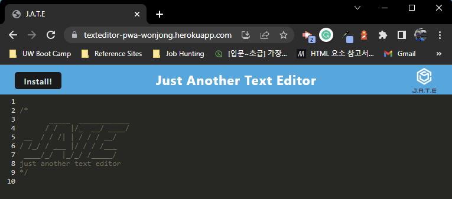
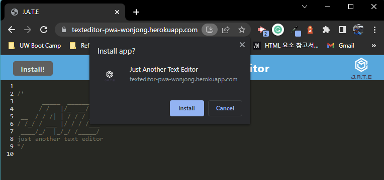
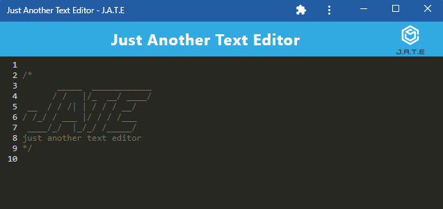
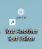

# PWA Text Editor

## Description

Build a text editor that runs in the browser. This app is a single-page application that meets the PWA criteria and consists of the server-side and the client-side.

-   Use node.js as a platform
-   Use express.js for the server operation
-   Use Webpack and html-webpack-plugin to bundle assets
-   Use webpack-pwa-manifest to generate manifest.json file
-   Use workbox-webpack-plugin to generate a service worker file
-   Use IndexedDB to save and retrieve the content of the text editor
-   Use idb.js for a wrapper of the IndexedDB API

## Table of Contents

1. [Installation](#installation)
2. [Usage](#usage)
3. [License](#license)
4. [Contributing](#contributing)
5. [Test](#test)
6. [Questions](#questions)

## Installation

On the command prompt :

1. npm install
2. npm run start

## Usage

1. WHEN I run `npm run start` from the root directory

    THEN I find that my application should start up the backend and serve the client

2. WHEN I run the text editor application from my terminal

    THEN I find that my JavaScript files have been bundled using webpack

3. WHEN I run my webpack plugins

    THEN I find that I have a generated HTML file, service worker, and a manifest file

4. WHEN I use next-gen JavaScript in my application

    THEN I find that the text editor still functions in the browser without errors

5. WHEN I open the text editor

    THEN I find that IndexedDB has immediately created a database storage

6. WHEN I enter content and subsequently click off of the DOM window

    THEN I find that the content in the text editor has been saved with IndexedDB

7. WHEN I reopen the text editor after closing it

    THEN I find that the content in the text editor has been retrieved from our IndexedDB

8. WHEN I click on the Install button

    THEN I download my web application as an icon on my desktop

9. WHEN I load my web application

    THEN I should have a registered service worker using workbox

10. WHEN I register a service worker

    THEN I should have my static assets pre cached upon loading along with subsequent pages and static assets

`Deployed URL: `https://texteditor-pwa-wonjong.herokuapp.com/

## License

Copyright (c) 2022 `wonjong2` (GitHub Username) Licensed under [the MIT License](https://choosealicense.com/licenses/mit/).

## Contributing

All your inputs are valuable and I love them.

-   Reporting a bug
-   Submiiting a fix
-   Proposing new features

## Test

N/A

## Questions

1. GitHub: https://github.com/wonjong2
2. If you have any questions, please reach out to wonjong2@gmail.com
